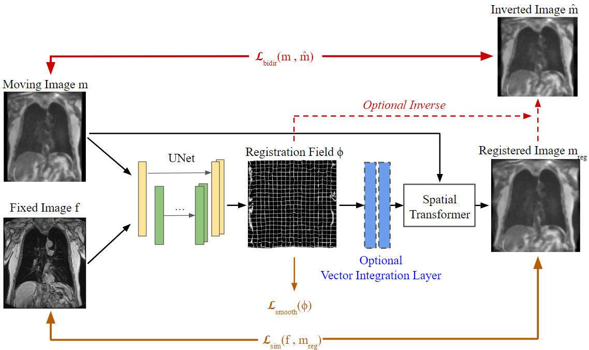
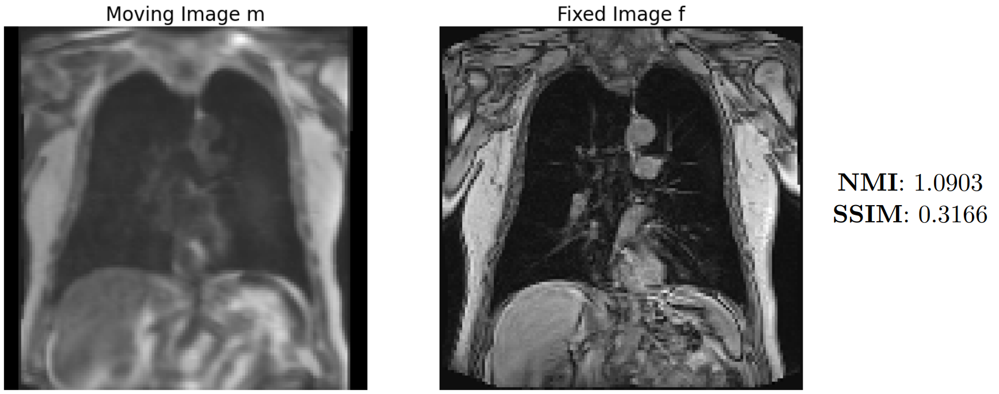
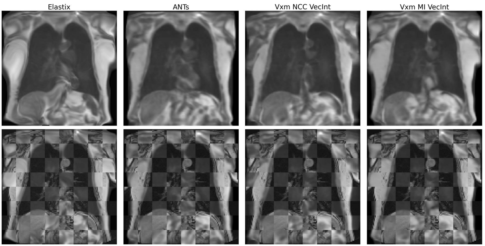
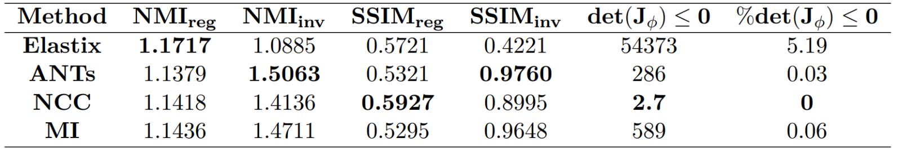
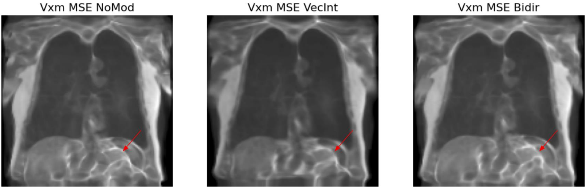
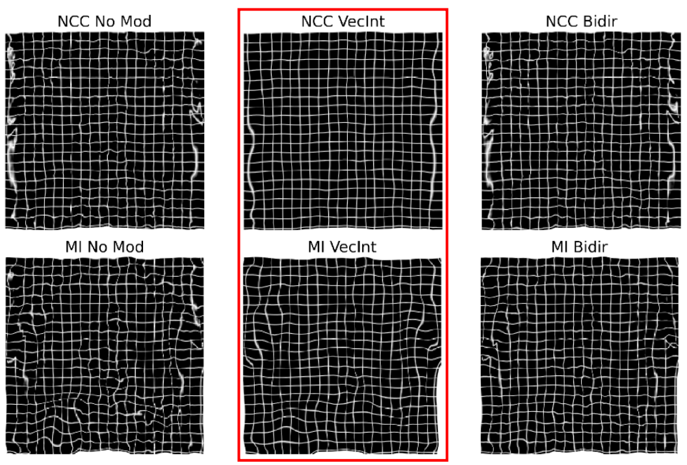

<h1 align="center">Registration of Lung MRI with Machine Learning Methods</h1>

  

Overview of the Network Archietecture

# Table of Contents
* [Introduction](#introduction)
* [Network Archietecture](#network-archietecture)
* [Experiment Setup](#experiment-setup)
* [Example Results](#example-results)
* [References](#references)

## Introduction
Welcome to the summary of my Bachelor Thesis on Registration of Lung MRI with ML Methods.  
This Research seeks to find a more efficient method for registering different modalities of medical images through machine leanring networks.   

Since there are existing models such as VoxelMorph, CycleMorph and TransMorph that are all proven to be succesful in registering Brain MRIs, we have chosen to use **VoxelMorph** *[Bal+19]* as a baseline and test its viability with 3D Perfusion and Morphological Lung MRIs.

Due to the limited availibility of Lung images, our network could only be trained on 300 distinct scans. Still, the outcome we produced performs comparable to state-of-the-art registration methods. Regarding the registration duration, traditional methods took between 20s and 350s, while our
CNN method only required 2s on CPU and even only 0.4s on GPU for the same registration
task.

## Network Archietecture 
We have implemented **VoxelMorph** *[Bal+19]* into the **CIDS framework** *[Koe+24]* with extra
functions that improved our model’s performance.  

### U-Net

- **Encoder** (Feature Extraction): Built with four downsampling blocks.  
Each block uses a 3D Convolution (3x3 kernel, stride 2), a LeakyReLU activation (alpha = 0.2), and Max Pooling (2x2 kernel, stride 2). This compresses the spatial dimensions while exponentially increasing the learned feature channels.  

- **Decoder** (Reconstruction): Consists of four upsampling blocks.  
Here we use up-convolutions and activation similar to those in the encoder. Then, instead of max pooling, we have upsampling layers to double the spatial resolution at each step.  

- **Skip Connections**: High-resolution, local features from the encoder are concatenated directly with the symmetrical layers in the decoder. This ensures fine anatomical details are preserved during reconstruction.  

- Several Convolution layers are added after the UNet to refine the resolution, extracting 3 featuress to represent a 3D registration field.

### Vector Integration Layer (Optional)

- To ensure the final registration is diffeomorphic, meaning the transformation is smooth and invertible, hence preserving anatomical topology, an optional Vector Integration Layer can be applied to the raw U-Net output. 

- **Guaranteed Reversibility**: This layer model our raw registration field as a flow over time. By integrating this flow (using a scaling and squaring method *[Ars+06]*), the model guarantees a diffeomorphic output. The final image warp is smooth, preserves structural integrity, and fully invertible.

### Spatial Transformation Layer

- **Differentiable Warping**: This layer effectively register our moving image base on the predicted registration field. It is fully differentiable, allowing the entire architecture to be trained end-to-end using standard backpropagation.

### Loss Functions

- To properly compare our result to the ground truth and improve, we tested different loss functions' performance.  

- **Mean Squared Error (MSE)**: Directly compares pixel intensities between the two images.  

- **Normalized Cross Correlation (NCC)**: Focuses on matching local structural patterns rather than exact pixel values

- **Mutual Information (MI)**: Evaluates the shared statistical relationship between image structures rather than raw intensities.  

- **Bi-Directional Loss**: Inspired by CycleMorph's Cycle Loss *[Kim+20]*. Enforces invertibility by calculating loss functions for both the forward and backward transformations. It penalizes the model if reversing the deformation doesn't recreate the original starting image

- **Regularization (Smoothness) Loss**: It acts as a physical constraint to keep the deformation realistic and smooth by preventing the network from aggressively streching the pixels just to force a perfect visual match. 

## Experiment Setup

- **Dataset**: 100 unique MRI Lung subjects, totaling 300 scan pairs.   
Morphological Scans are the fixed image, while Perfusion Scans are the moving image.

- **Data Augmentation**: Each subject includes one morphological scan and three perfusion scans taken at different time points (t=1, 2, 3). This increases the training volume and improves network robustness against temporal variations.

- **Data Split**: Handled subject-wise to prevent data leakage:  
210 Training samples | 45 Validation samples | 45 Testing samples

- **Preprocessing Pipeline**:  
Initial Alignment: Affinely registered using the ANTs fastaffine function.  
Resizing: Volumes are downsized to 64 x 128 x 128  
Padding: Native aspect ratios are strictly preserved, with any remaining resolution filled using zero-padding.

- We tested the 3 different losses  
Each loss is tested with no modification, addition of Vector Integration Layer or addition of Bi-Directional Loss

- Each set up is trained for 1000 epochs  
Batch size of 8   
Learning rate of $10^{-4}$

- Validation Metrics:  
**Structural Similarity Test (SSIM)** (-1 to 1): 1 = perfect similarity, 0 = no similarity, -1 = complete dissimilarity.  
**Normalized Mutual Information (NMI)** (1 to 2): 2 = perfect correlation, 1 = complete uncorrelation.  
**Jacobian Test**: Evaluate whether our registration is diffeomorphic, smaller the better  

- Traditional Methods:  
ANTs - Symmetric Normalization  
Elastix - B-Spline Displacement

## Example Results

Quick summary for the results. For more comprehensive analysis and discussion, please view the thesis.  

### Reference Input Image

  

Reference Input Pair, slice 32 of scan 37 from our test set.
  

### Final Comparison

- We choose the best performing set ups: which are NCC and MI Losses, both with the addition of Vector Integration Layer  
- We can see here through the grid view, the outline of the lung lines up really well with the fixed image.  
- Note: The Final ML results here are trained for 5000 epochs

  

Side by side comparison of registered image using tradisional methods vs ML methods

### Final Scores

- We see here that using NCC loss yields the highest SSIM score for registered image while having the best diffeomophism base on the Jacobian Test.

  

Performance of each methods

### Decision Making

- We dropped MSE Loss due to artifact creation as it is unable to adjust for the contrast and intensity difference between perfusion and morphological MRIs. 

  

Using MSE as loss function creates unwanted artifacts
  

 
 

- We chose to add Vector Integration Layer due to its superior diffeomorphism 

  

Adding the Vector Integration Layer produce way smoother registration field

## References

- [Ars+06]   
Vincent Arsigny, Olivier Commowick, Xavier Pennec und Nicholas Ayache. „A
Log-Euclidean Framework for Statistics on Diffeomorphisms“. In: Medical Image
Computing and Computer-Assisted Intervention – MICCAI 2006. Hrsg. von
Rasmus Larsen, Mads Nielsen und Jon Sporring. Berlin, Heidelberg: Springer,
2006, S. 924–931. isbn: 978-3-540-44708-5. doi: 10.1007/11866565_113.

- [Bal+19]  
Guha Balakrishnan, Amy Zhao, Mert R. Sabuncu, John Guttag und Adrian
V. Dalca. „VoxelMorph: A Learning Framework for Deformable Medical Image
Registration“. In: IEEE Transactions on Medical Imaging 38.8 (Aug. 2019),
S. 1788–1800. issn: 0278-0062, 1558-254X. doi: 10.1109/TMI.2019.2897538.
arXiv: 1809.05231[cs]. url: http://arxiv.org/abs/1809.05231 (besucht
am 08. 05. 2024)

- [Kim+20]  
Boah Kim, Dong Hwan Kim, Seong Ho Park, Jieun Kim, June-Goo Lee und
Jong Chul Ye. CycleMorph: Cycle Consistent Unsupervised Deformable Image
Registration. 13. Aug. 2020. arXiv: 2008.05772[cs, eess, stat]. url: http:
//arxiv.org/abs/2008.05772 (besucht am 08. 05. 2024).

- [Koe+24]  
A. Koeppe, D. Rajagopal, J. Grolig, M. Mundt, T. Witter und Y. Zhao. CIDS.
https://gitlab.com/intelligent-analysis/cids. 2024.  